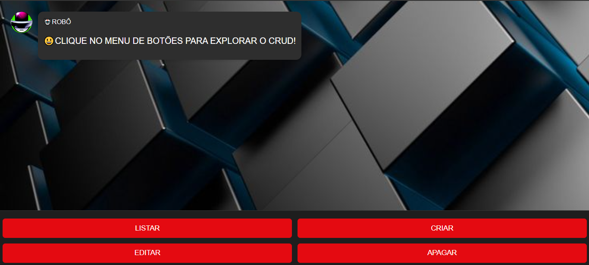
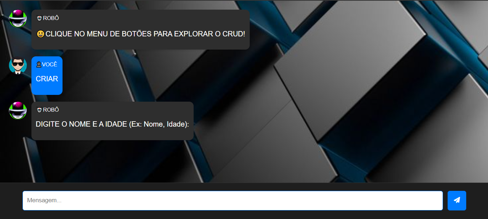
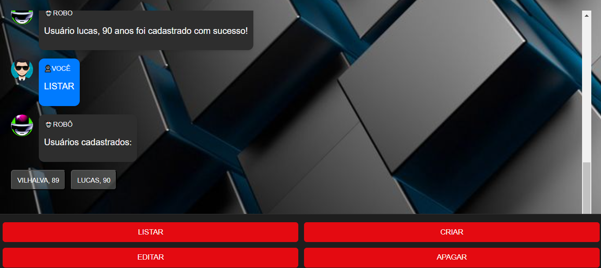

# PSEUDOCRUD COM WEBBOT
👨‍🏫GERENCIE O NOME E IDADE DOS USUÁRIOS EM UMA ARRAY.

   
  
  

## DESCRIÇÃO:
Esse bot é um assistente interativo projetado para gerenciar um sistema de cadastro de usuários. Ele permite que os usuários realizem operações básicas, como listar, criar, editar e apagar registros de usuários. O bot interage com o usuário através de uma interface de chat, respondendo a comandos textuais e botões clicáveis.

## FUNCIONALIDADES:
1. **Listar Usuários**:
   - Permite visualizar todos os usuários cadastrados. Se não houver usuários, o bot informará que a lista está vazia.

2. **Criar Usuário**:
   - O usuário pode cadastrar um novo usuário informando o nome e a idade no formato "Nome, Idade". O bot verifica se o usuário já está cadastrado para evitar duplicatas.

3. **Editar Usuário**:
   - Permite editar os detalhes de um usuário existente. O usuário deve clicar no botão correspondente ao usuário que deseja editar e, em seguida, fornecer o novo nome e idade.

4. **Apagar Usuário**:
   - Permite remover um usuário do sistema. O usuário deve clicar no botão correspondente ao usuário que deseja apagar.

## EXECUTANDO O PROJETO:
1. **Início**:
   - Abra o arquivo `./CODIGO/index.html` no navegador de sua preferencia.
   - Ao acessar o bot, uma mensagem de boas-vindas será exibida, junto com botões de menu para as opções disponíveis (Listar, Criar, Editar, Apagar).

2. **Interagindo com o Menu**:
   - Clique nos botões de menu para realizar ações específicas. O bot irá responder com informações relevantes e pode apresentar novos botões ou campos de entrada, dependendo da ação escolhida.

3. **Entradas de Texto**:
   - Para criar um usuário, clique no botão "CRIAR" e insira os dados no formato "Nome, Idade" no campo de entrada. Após enviar, o bot confirmará o cadastro.

4. **Edição e Exclusão**:
   - Para editar ou apagar um usuário, clique nos botões correspondentes. O bot apresentará os usuários cadastrados como botões inline. Clique no nome do usuário que deseja editar ou apagar, e siga as instruções fornecidas pelo bot.

5. **Erros e Mensagens**:
   - Se o bot não entender um comando ou se ocorrer um erro, ele informará o usuário. Também retornará ao menu principal após cada ação, permitindo novas interações.

## NÃO SABE?
- Entendemos que para manipular arquivos em `HTML`, `CSS` e outras linguagens relacionadas, é necessário possuir conhecimento nessas áreas. Para auxiliar nesse aprendizado, oferecemos cursos gratuitos disponíveis:
* [CURSO DE HTML E CSS](https://github.com/VILHALVA/CURSO-DE-HTML-E-CSS)
* [CURSO DE JAVASCRIPT](https://github.com/VILHALVA/CURSO-DE-JAVASCRIPT)
* [CURSO DE JQUERY](https://github.com/VILHALVA/CURSO-DE-JQUERY)
* [CONFIRA MAIS CURSOS](https://github.com/VILHALVA?tab=repositories&q=+topic:CURSO)

## CREDITOS:
- [PROJETO CRIADO PELO VILHALVA](https://github.com/VILHALVA)